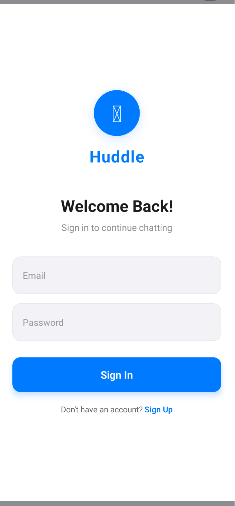
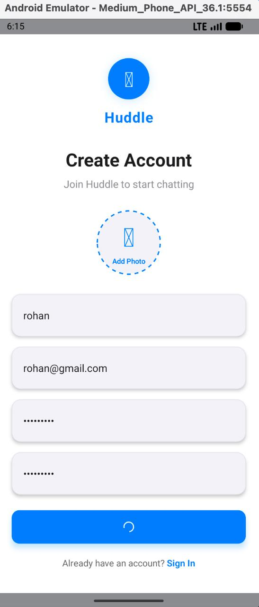

# NativeChatApp - Real-Time Chat Application

**Task ID:** NativeChatApp

A feature-rich, real-time chat application built with **React Native** and **Firebase**. This app provides seamless messaging with online/offline status tracking, read receipts, live location sharing, typing indicators, and push notifications.


## Screenshots

<p align="center">
  
  
</p>

## Features

### Implemented Features

1. **User Authentication**
   - Sign up and login using Firebase Authentication
   - User profile management (name, photo, status)
   - Secure password authentication

2. **Real-Time Messaging**
   - One-on-one chat conversations
   - Real-time message sending and receiving
   - Persistent message history with timestamps

3. **Online/Offline Status**
   - Display user's online/offline presence
   - Show "Last seen" timestamp
   - Real-time presence updates

4. **Read Receipts**
   - Three-state message status: sent (✓), delivered (✓✓), read (✓✓ blue)
   - Automatic status updates when messages are viewed

5. **Live Location Sharing**
   - Share current location with chat contacts
   - Display location on interactive map
   - Distance calculation between users

6. **Typing Indicator**
   - Show "typing..." when the other user is composing
   - Auto-hide after inactivity

7. **Push Notifications**
   - Firebase Cloud Messaging integration
   - Notify users when app is backgrounded/closed

8. **Additional Features**
   - Beautiful, modern UI
   - User search functionality
   - Unread message counter
   - Profile image upload
   - Custom status messages

## Tech Stack

- **Frontend:** React Native 0.74.5
- **Navigation:** React Navigation 6.x
- **Backend:** Firebase (Authentication, Firestore, Realtime Database, Storage, Cloud Messaging)
- **Maps:** React Native Maps
- **Icons:** React Native Vector Icons
- **Notifications:** Notifee

## Prerequisites

- Node.js (v16 or higher)
- npm or yarn
- React Native CLI
- Android Studio (for Android development)
- CocoaPods (for iOS dependencies - macOS only)

## Installation & Setup

### 1. Clone the Repository

```bash
git clone https://github.com/DevanshSharma351/NativeChatApp.git
cd NativeChatApp
```

### 2. Install Dependencies

```bash
npm install

# For iOS (macOS only)
cd ios && pod install && cd ..
```

### 3. Firebase Setup

1. Create a project at [Firebase Console](https://console.firebase.google.com/)
2. Add iOS and Android apps to your Firebase project
3. Download configuration files:
   - **iOS:** `GoogleService-Info.plist` → place in `ios/NativeChatApp/`
   - **Android:** `google-services.json` → place in `android/app/`

4. Enable these Firebase services in the console:
   - Authentication (Email/Password)
   - Cloud Firestore
   - Realtime Database
   - Cloud Storage
   - Cloud Messaging

### 4. Google Maps Setup

1. Get API key from [Google Cloud Console](https://console.cloud.google.com/)
2. **Android:** Add to `android/app/src/main/AndroidManifest.xml`:
   ```xml
   <meta-data
     android:name="com.google.android.geo.API_KEY"
     android:value="YOUR_GOOGLE_MAPS_API_KEY"/>
   ```
3. **iOS:** Add to `ios/NativeChatApp/AppDelegate.mm`:
   ```objective-c
   [GMSServices provideAPIKey:@"YOUR_GOOGLE_MAPS_API_KEY"];
   ```

## Running the App

```bash
# Start Metro bundler
npm start

# Run on Android
npm run android

# Run on iOS (macOS only)
npm run ios
```

## Key Dependencies

```json
{
  "react": "18.2.0",
  "react-native": "0.74.5",
  "@react-navigation/native": "^6.1.9",
  "@react-native-firebase/app": "^20.5.0",
  "@react-native-firebase/auth": "^20.5.0",
  "@react-native-firebase/firestore": "^20.5.0",
  "@react-native-firebase/database": "^20.5.0",
  "@react-native-firebase/storage": "^20.5.0",
  "@react-native-firebase/messaging": "^20.5.0",
  "react-native-maps": "^1.8.3",
  "react-native-vector-icons": "^10.0.2",
  "@notifee/react-native": "^7.9.0"
}
```

## Project Structure

```
NativeChatApp/
├── src/
│   ├── config/              # Firebase configuration
│   ├── context/             # React Context (Auth)
│   ├── services/            # Firebase services
│   ├── screens/             # App screens
│   ├── navigation/          # Navigation setup
│   └── App.js              # Root component
├── android/                # Android native code
├── ios/                    # iOS native code
└── index.js                # App entry point
```

## Troubleshooting

### Common Issues

1. **Metro bundler errors**
   ```bash
   npm start -- --reset-cache
   ```

2. **iOS build fails**
   ```bash
   cd ios && pod install && cd ..
   ```

3. **Android build fails**
   ```bash
   cd android && ./gradlew clean && cd ..
   ```

4. **Firebase not connecting**
   - Verify `google-services.json` (Android) and `GoogleService-Info.plist` (iOS) are in correct locations
   - Check Firebase project configuration

5. **Maps not showing**
   - Verify Google Maps API key is correct
   - Ensure billing is enabled in Google Cloud Console

## Known Issues

- **Android Emulator DNS:** Some Android emulators may have DNS resolution issues preventing Firebase connectivity. This is a macOS-specific emulator configuration issue. Workaround: Use a physical device or configure emulator DNS settings.

## Security Notes

- Never commit Firebase credentials to public repositories
- Use environment variables for sensitive data in production
- Implement proper Firebase security rules
- Validate user inputs

## Contributing

Contributions are welcome! Please feel free to submit a Pull Request.

## License

This project is licensed under the MIT License.

## Author

**Devansh Sharma**
- GitHub: [@DevanshSharma351](https://github.com/DevanshSharma351)

## Acknowledgments

- React Native team
- Firebase team
- React Navigation
- All open-source contributors

---

**Note:** This is an educational project. Add proper error handling, testing, and optimizations before production deployment.

Made with ❤️ using React Native and Firebase
